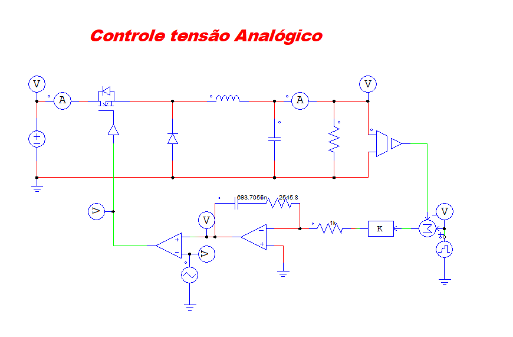

#  Conversor Buck com Controle PI

Projeto de um conversor DC-DC do tipo Buck com controle de tensão utilizando um controlador PI analógico, desenvolvido e simulado no PSIM.

---

##  Objetivo

Projetar e validar um sistema de controle de tensão para um conversor Buck, garantindo:

- Regulação da tensão de saída
- Boa margem de fase
- Estabilidade do sistema
- Resposta dinâmica adequada

---

##  Descrição do Sistema

O conversor Buck reduz uma tensão de entrada contínua para um valor menor na saída, utilizando:

- Chave eletrônica (PWM)
- Indutor (L)
- Capacitor (C)
- Carga resistiva

O controle é feito por um **controlador PI analógico**, responsável por ajustar o duty cycle para manter a tensão de saída regulada.

---

##  Modelo do Sistema

---

##  Parâmetros do Sistema

| Parâmetro              | Valor        |
|----------------------|-------------|
| Tensão de entrada    | 50 V        |
| Tensão de saída      | 20 V        |
| Potência nominal     | 100 W       |
| Frequência de chaveamento | 20 kHz |
| Indutância (L)       | 1.2 mH      |
| Capacitância (C)     | 15.6 µF     |
| Resistência de carga | 4 Ω         |

---

##  Projeto do Controlador PI

O controlador PI é definido por:

C(s)=Kc*(s+wz)/s

### Critérios de Projeto

- Frequência de cruzamento: **2 kHz**
- Margem de fase: **60°**

---

##  Resultados do Projeto

A partir dos cálculos:

- **Ganho proporcional (Kc):** 2.5458  
- **Frequência do zero (ωz):** 566.24 rad/s  

### Implementação com componentes:

- R1 = 1 kΩ  
- R2 = 2545.8 Ω  
- C = 693.7 nF  

---

##  Implementação do PI

A função de transferência implementada é:

Gc(s)=-(R2/R1)*(s+1/(R2*C))/s 

Para mais detalhes dos calculos :

[Acessar memorial de cálculo](docs/calculo_de_controle_PI_para_conversor_BUCK.pdf)

##  Como Executar

1. Extrair o arquivo `.smv` da pasta ConversorBUCKAnalogico.zip
2. Execute o arquivo `.smv` extraido
3. Dar run na simulação
3. Observe:
   - Tensão de saída (Vo)
   - Tensão de entrada (Vi)

   ## Autor

Luiz Henrique Medeiros Santos 
